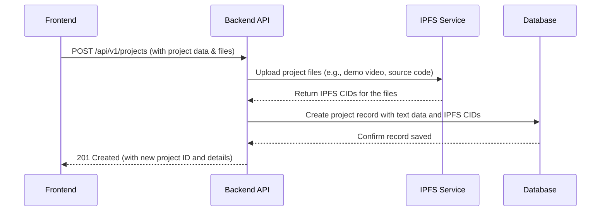
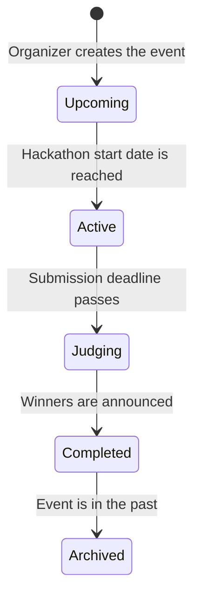

# HackX Buildathon - Backend Starter Kit

## Overview
This document outlines the backend design for the **HackX Buildathon Platform**, a fully open-source solution for hosting hackathons where all critical data lives on **IPFS**. This starter kit enables developers to quickly build and deploy a platform that serves the needs of both hackathon organizers and participants. The backend is built using **FastAPI** following a clean, scalable architecture.

## Key Features
- 🚀 **Full Hackathon Lifecycle Management:** From creation and discovery to judging and closing.
- 📦 **Core IPFS Integration:** For project submissions, code, demos, and metadata, ensuring permanence.
- 👤 **User Authentication & Profiles (JWT):** Secure access for participants and organizers.
- 🤝 **Team Formation & Management:** Enables participants to form and manage teams.
- 🏆 **Project Submission & Showcase:** A structured workflow for submitting and displaying projects.
- 🗳️ **Community & Judge Interaction:** Commenting and voting systems for engagement.
- 🧱 **Clean Architecture:** Scalable and easy to understand (endpoint → service → repository).

---

## Project Architecture
This backend is structured for scalability and easy collaboration.

athenax-backend/
├── app/
│   ├── api/             # API route definitions (e.g., hackathons, users, projects)
│   ├── common/          # Shared logic, schemas, and response models
│   ├── core/            # App configuration, logging, and startup events
│   ├── database/        # Database models (SQLAlchemy), session management, and CRUD operations
│   ├── domain/          # Core business entities and logic (e.g., Hackathon, Project, Team)
│   ├── enums/           # Enum definitions for consistent states (e.g., HackathonStatus, ProjectStatus)
│   ├── exceptions/      # Custom exception handlers for clean error responses
│   ├── infrastructure/  # External service integrations (IPFS, JWT, email clients)
│   ├── middleware/      # Request/response middleware (e.g., authentication, error handling)
│   ├── tests/           # Unit and integration tests for all modules
│   └── utils/           # Helper functions and utilities
├── .env.example         # Example environment variables file
├── .gitignore           # Files and folders to be ignored by Git
├── Dockerfile           # Docker container setup for production
├── docker-compose.yaml  # Docker services configuration for local development
├── requirements.txt     # Python project dependencies
├── README.md            # This project documentation
└── start.sh             # Shell script to run the application

---

## API Endpoints

### 👤 Auth & User Management
| Method | Endpoint | Description |
|--------|----------|-------------|
| POST | `/api/v1/auth/register` | Register a new user profile. |
| POST | `/api/v1/auth/login` | Get JWT access token. |
| GET | `/api/v1/users/me` | Get current authenticated user's profile. |
| PATCH | `/api/v1/users/me` | Update current user's profile. |

---

### 🌐 Hackathon Management
| Method | Endpoint | Description |
|--------|----------|-------------|
| POST | `/api/v1/hackathons` | **(Organizer)** Create a new hackathon. |
| GET | `/api/v1/hackathons` | Discover all active and upcoming hackathons. |
| GET | `/api/v1/hackathons/{hackathon_id}` | Get detailed information for a single hackathon. |
| PATCH | `/api/v1/hackathons/{hackathon_id}` | **(Organizer)** Update hackathon details. |
| GET | `/api/v1/hackathons/{hackathon_id}/projects`| View all projects submitted to a hackathon. |

---

### 🚀 Project & Submission Management
| Method | Endpoint | Description |
|--------|----------|-------------|
| POST | `/api/v1/projects` | Submit a new project to a hackathon. |
| GET | `/api/v1/projects/{project_id}` | Get details for a single project. |
| PATCH | `/api/v1/projects/{project_id}` | Update an existing project submission. |
| POST | `/api/v1/projects/{project_id}/comment` | Add a comment to a project. |
| POST | `/api/v1/projects/{project_id}/vote` | Cast a vote for a project. |

---

### 🤝 Team Management
| Method | Endpoint | Description |
|--------|----------|-------------|
| POST | `/api/v1/teams` | Create a new team for a hackathon. |
| POST | `/api/v1/teams/{team_id}/join` | Request to join an existing team. |
| GET | `/api/v1/teams/{team_id}` | Get team details and members. |

---

### 📦 File Upload (IPFS)
| Method | Endpoint | Description |
|--------|----------|-------------|
| POST | `/api/v1/ipfs/upload` | Upload a file (demo, code zip) to IPFS, returns a CID. |

---

### 🩺 System
| Method | Endpoint | Description |
|--------|----------|-------------|
| GET | `/health` | Health check endpoint for monitoring. |

---

## Architecture Flow: Project Submission
This diagram shows the sequence of events when a participant submits their project.

## State Transitions: Hackathon Lifecycle
This diagram illustrates the different states a hackathon can be in.

