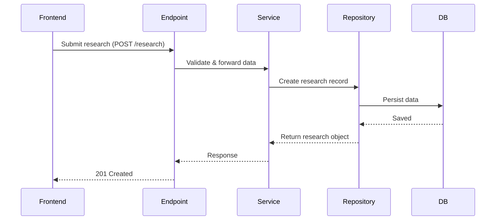
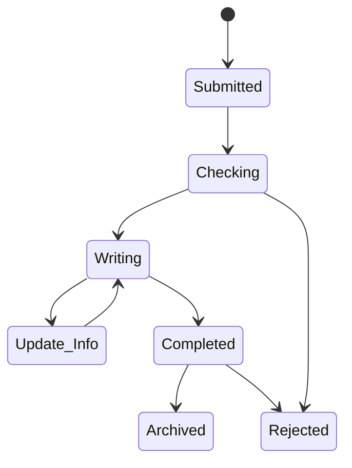

# ScholarX Backend – Research Module Specification

## Overview
This document outlines the backend design for the **ScholarX Research module**, which enables authenticated users to submit, update, and manage research projects via a structured, multi-step workflow. The backend is built using **FastAPI** and follows a clean **Domain-Driven Design (DDD)** architecture.

## Key Features
- ✅ User authentication (JWT)
- 🧠 Multi-step research submission (10 steps)
- 🔁 Research state transitions
- 💬 Commenting system per research
- 📁 File uploads (whitepapers, brand kits, etc.)
- 🧱 DDD architecture (endpoint → service → repository)
- 🚦 Rate limiting for fair usage

---

## API Endpoints (with Rate Limits)

### Authentication
| Method | Endpoint | Description | Rate Limit |
|--------|----------|-------------|------------|
| POST | /api/v1/users/login | Get access token | `10/min` |
| POST | /api/v1/users/logout | Invalidate token | `10/min` |
| POST | /api/v1/users/verify | Check auth status | `20/min` |

---

### 👤 Users
| Method | Endpoint | Description | Rate Limit |
|--------|----------|-------------|------------|
| POST | `/api/v1/users/` | Register new user | `5/min` |
| PATCH | `/api/v1/users/` | Update current user profile | `5/min` |
| GET | `/api/v1/users/me/` | Get current user profile | `20/min` |

---

### 📚 Research
| Method | Endpoint | Description | Rate Limit |
|--------|----------|-------------|------------|
| GET | /api/v1/research/ | Get all research records | `60/min` |
| POST | /api/v1/research/ | Submit new research | `5/min` |
| GET | /api/v1/research/user/ | Get current user's research | `30/min` |
| GET | /api/v1/research/{research_id} | Get research by ID | `30/min` |
| PATCH | /api/v1/research/{research_id} | Update existing research | `10/min` |
| PATCH | /api/v1/research/{research_id}/state | Update research state | `10/min` |
| POST | /api/v1/research/{research_id}/comment | Add comment to research | `15/min` |
| GET | /api/v1/research/state/{state} | Get research by state | `30/min` |

---

### Files
| Method | Endpoint | Description | Rate Limit |
|--------|----------|-------------|------------|
| POST | /api/v1/s3/{bucket} | Upload file to S3 | `3/min` |
| POST | /api/v1/s3/download/ | Get file download URL | `10/min` |

---

### 💌 Wishlist
| Method | Endpoint | Description | Rate Limit |
|--------|----------|-------------|------------|
| GET | `/api/v1/wishlist/` | Get wishlist entries | `10/min` |
| POST | `/api/v1/wishlist/` | Add to wishlist | `5/min` |

---

### 🩺 System
| Method | Endpoint | Description | Rate Limit |
|--------|----------|-------------|------------|
| GET | `/health` | Health check endpoint | `60/min` |

---

## Architecture Flow

## State Transitions
